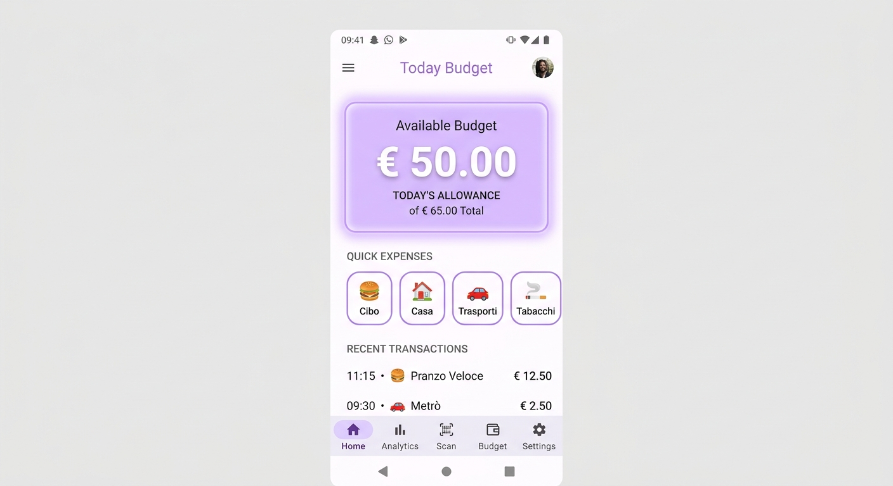

# 📅 Today Budget 💸

**Today Budget** è un'applicazione Android moderna, intuitiva e dal design ricercato, realizzata per aiutarti a gestire le tue spese quotidiane senza sforzo. A differenza delle classiche ed intricate app di contabilità, **Today Budget** si concentra su ciò che conta davvero oggi: **quanto puoi spendere in questo momento.**

Disponibile in modalità completamente **gratuita, pubblica e open-source**.

---

## 📱 Schermata Principale

  

---

## ✨ Funzionalità Chiave

- **💸 Calcolo Automatico del Budget Giornaliero**: Visualizza all'istante l'importo esatto disponibile per la giornata odierna. L'app ricalcola automaticamente la cifra in base ai giorni rimanenti nel tuo ciclo mensile e alle spese già effettuate.
- **🚀 Inserimento Rapido con Emoji**: Registra le spese quotidiane più frequenti in un secondo premendo i pulsanti rapidi personalizzati per categoria (*Cibo*, *Casa*, *Trasporti*, *Tabacchi* con comode icone emoji illustrative).
- **📊 Statistiche & Trend**: Visualizza grafici interattivi a ciambella per capire al volo dove finiscono i tuoi soldi, insieme a grafici di andamento storico dettagliati filtrabili per ogni singola categoria.
- **⚙️ Altamente Personalizzabile**:
  - Scegli il simbolo della valuta che preferisci.
  - Definisci il giorno del mese in cui ha inizio il tuo ciclo di budget.
  - Imposta l'orario personalizzato di inizio giornata (ad esempio le 04:00 del mattino, ideale per chi fa tardi la sera!).
  - Attiva la modalità **Risparmio/Carry Over** per accumulare automaticamente i risparmi del mese/giorno precedente nel budget attuale.
- **🔒 Privata e Sicura**: L'applicazione funziona completamente offline. I tuoi dati sensibili sono salvati solo sul tuo dispositivo tramite un database SQLite locale ultra-veloce (Room Database). Nessun server esterno, massima privacy.

---

## 🛠️ Tecnologie Utilizzate

L'applicazione è sviluppata seguendo i più elevati standard moderni dello sviluppo Android:

- **Kotlin**: Linguaggio moderno, sicuro ed espressivo.
- **Jetpack Compose**: UI completamente reattiva progettata interamente con il moderno framework dichiarativo di Google.
- **Material Design 3 (M3)**: Palette colori pastello coerenti, forme levigate ("Sweet Theme") ed eccezionale contrasto visivo adatto sia alle visualizzazioni diurne che notturne.
- **Room Database**: Gestione della persistenza locale dei dati con un database SQLite strutturato.
- **Kotlin Coroutines & Flow**: Gestione asincrona dei dati e aggiornamenti dell'interfaccia reattivi in tempo reale.
- **Architettura MVVM**: Separazione strutturata dei flussi logici (Model-View-ViewModel) per garantire manutenibilità e testabilità ottimali.

---

## 👥 Creatore e Sviluppatore

L'applicazione **Today Budget** è ideata, sviluppata e pubblicata da:

- **Sviluppatore**: **Brombolo** (GitHub: [@Brombolo](https://github.com/Brombolo))
- **Contatto email**: [polloblu00@gmail.com](mailto:polloblu00@gmail.com)

Per qualsiasi domanda o proposta di miglioramento, si prega di aprire una Issue sul repository GitHub o di inviare un'email all'indirizzo sopra indicato.

---

## 📄 Licenza e Distribuzione

Questo progetto è pubblicato come **software completamente libero e gratuito**. 

Il codice è distribuito sotto i termini della licenza **GNU GPL v3 (GNU General Public License versione 3)**. Questo garantisce che chiunque possa utilizzare, modificare e distribuire l'applicazione, a patto che ogni software derivato continui ad essere distribuito sotto la stessa identica licenza open-source.

Per saperne di più ed esaminare i termini legali completi, consulta il file [LICENSE](./LICENSE) incluso in questo repository.

---

Confezionato con cura da <b>Brombolo</b> per una gestione del budget quotidiano più serena e consapevole. 🌸

